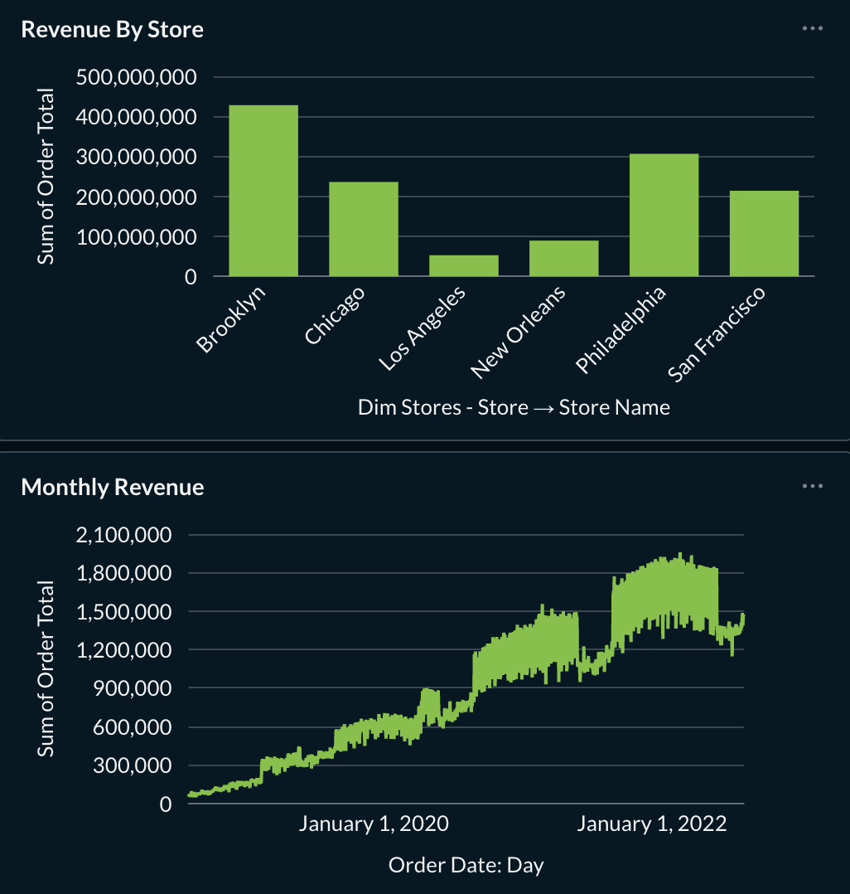

# Jaffle Shop Snowflake — Incremental Models, Snapshots & BI Integration

A dbt project built on synthetic Jaffle Shop data, demonstrating a full 
analytics engineering workflow: incremental loading, SCD Type 2 snapshots, 
a Kimball-style star schema, and BI dashboard integration with Metabase.

## Project Structure
- **staging**: cleans and renames raw source data
- **marts**: star schema with fact and dimension tables
  - `fct_orders`: incremental fact table with order-level metrics
  - `dim_customers`, `dim_products`, `dim_stores`: dimension tables
- **snapshots**: tracks historical changes in order data (SCD Type 2)
- **exposures**: documents downstream BI usage in Metabase

## Key Concepts Demonstrated
- Incremental models: only processes new data on each run
- dbt Snapshots: captures historical changes (SCD Type 2)
- Star schema design (Kimball methodology)
- dbt Exposures: documents BI dependencies
- BI integration with Metabase

## Dashboard



Dashboard includes monthly revenue trends and revenue by store comparison, 
built on top of `fct_orders` and `dim_stores`.

## Tools
- dbt-core, dbt-snowflake
- Snowflake
- Metabase (via Docker)
- jafgen (synthetic data generation)

## How to Run

### First time (full load)
```bash
dbt seed
dbt run
dbt test
```

### Incremental run (new data only)
```bash
dbt seed --full-refresh
dbt run --select fct_orders
```

### Snapshots
```bash
dbt snapshot
```

### Documentation
```bash
dbt docs generate
dbt docs serve
```